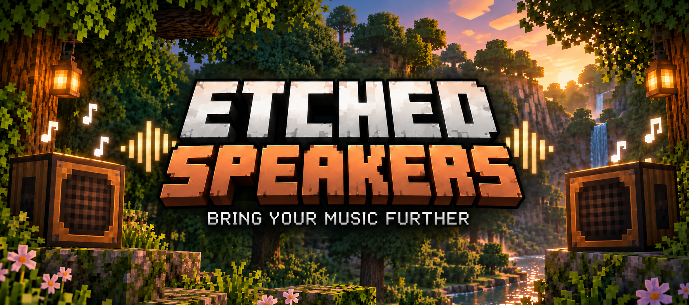
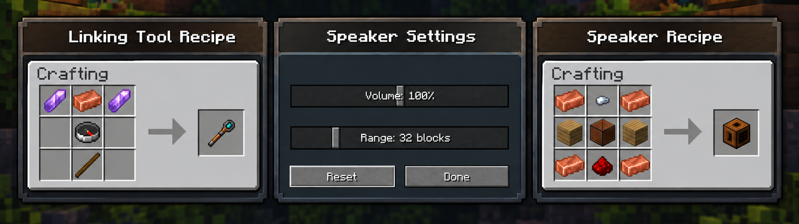

# Etched Speakers

  

**Etched Speakers** adds synchronized, linkable speakers for [Etched](https://www.curseforge.com/minecraft/mc-mods/etched).

Connect multiple Speakers to a vanilla Jukebox playing an Etched record or to an Etched Album Jukebox and play the same music across your build.

Each Speaker has its own configurable **volume** and **audible range**, while staying synchronized with the original playback.

  

## How to use

1. Craft a **Speaker** and a **Linking Tool**.
2. Right-click a Jukebox or Album Jukebox with the Linking Tool to select it.
3. Right-click a Speaker with the Linking Tool to connect it.
4. Repeat with more Speakers to connect them to the same source.
5. Right-click a Speaker normally to open **Speaker Settings**.
6. Adjust its volume and audible range.
7. **Shift + Right-click** a Speaker with the Linking Tool to unlink it.

## Requirements

- **Minecraft:** 1.21.1
- **NeoForge:** 21.1.249
- **Java:** 21
- **Etched:** 5.1.0
